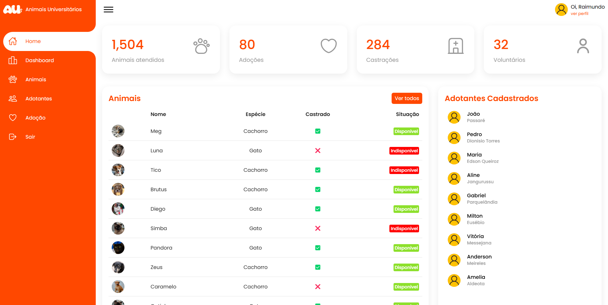

<h1 align="center">
  AUdmin 😸
</h1>

## 📚 Projeto

Sistema de gestão em desenvolvimento para auxiliar os **Animais Universitários**, um incrível projeto voluntário que oferece assistência aos animais abandonados no Campus do Pici da UFC.

O objetivo principal do sistema é simplificar e centralizar a gestão dos animais resgatados e dos adotantes, reduzindo a dependência de planilhas e reunindo todas as informações em um único lugar.

## 💻 Funções

Até o momento, o sistema conta com as seguintes funções:

- Cadastro de Animais e Adotantes
- Alterar/Excluir dados de Animais e Adotantes

## 💼 Tecnologias utilizadas

Para o desenvolvimento deste projeto utilizei as seguintes tecnologias:

- PHP
- SQLite
- Arquitetura MVC
- HTML/CSS
- JavaScript
- Git e Github
